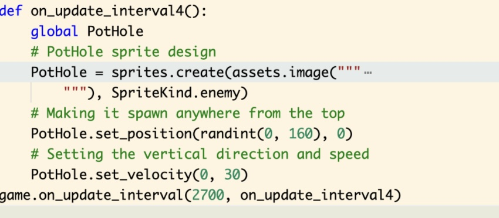

# Get off the road!
Get off the road!, is a video game inspired by the nostaglic experience of playing a game you once used to play in your childhood but sadly facing the reality that it may not be as fun now that you have grown up. 
I wanted to make something that evoked those feelings of nostalgia while also being something that one can enjoy and is relatable to them now in their adult context. 
Get off the road is that game! 
Mixing similar game play elememts from childhood classic games but set in a context relatable to us now, which is about navigating the terrible Sydney traffic with potholes and bad drivers, as fast as you can. 

## Table of Contents
*  [General Information](#general-Information)
*  [Technolgoies Used](#Technologies-Used) 
*  [Features](#Features)
*  [Screenshots](#Screenshots)
*  [Setup](#Setup)
*  [Usage](#Usage)
*  [Acknowledgements](#Acknowledgements) 

## General Information
Get off the road!, purpose is to unlock that childlike part of your brain by evoking feelings of nostalgia and inviting play. Through using similar game play motivations and interactions from childhood games to create fast interactive play and placing it in a relatable context, Get off the road achieves this purpose. It is a game that is targetted to adults when they want a break from their stressful life and want to feel like a child again. I personally love playing games on my phone when I have a quick break or waiting in line for something, so having a game that is easy to play and understand was essential. 
* Get off the road is all about navigtaing through obstacles to try and not lose lives while the roads have seen better days and the drivers act like they have never driven before. 

## Technolgoies Used
* Microsoft MakeCode Aracde 
* Python

## Features 
*  Jump and dodge (moving left and right) multiple enemies that come at you
*  Try and get through each 15 seconds to increase your score
*  Enemies spawn faster and are quicker as you continue to play
*  You only have three lives

## Screenshots 
     

## Setup 
For game:
* Click the link added in this Git Repository and it will take you to the game
For my Git Hub:
* Please see the different weeks files to see prototypes, tutorials and code that guided me and examples of the code i wrote
  
## Usage 
* For the game:
* Press A to start
* Use left and right arrows to move along the screen
* Press A to jump

## Acknowledgements 
* My project was inspired and helped by:
* Microsoft. (n.d.). Cat Jumper. [Game Code]. Microsoft MakeCode Arcade. https://arcade.makecode.com/blocks-games/cat-jumper 
* Microsoft MakeCode. (2020, September 18). How to Increase the Difficulty of Your MakeCode Arcade Game [Video]. YouTube. https://www.youtube.com/watch?v=KFT9joQrSSM
* I did have some other resources help guide me as well however these were the ones that were most helpful 

